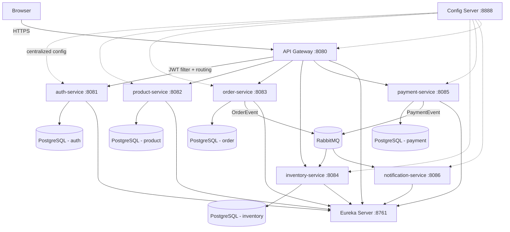

# 🛒 ecommerce-angular-springboot

A **production-grade, full-stack e-commerce platform** demonstrating best-practice architecture end-to-end.

- **Backend** — Spring Boot 3.x microservices, JWT security, PostgreSQL, Kafka/RabbitMQ, Resilience4j
- **Frontend** — Angular 17+ standalone components, signals, lazy routes, functional guards/interceptors

> **Learning project**: every file is heavily commented to explain the architectural concept being used.

---

## 📐 Architecture Diagram



---

## 🗂️ Repository Layout

```
/backend
  /eureka-server          # Netflix Eureka service registry
  /config-server          # Spring Cloud Config (centralized config)
  /api-gateway            # Spring Cloud Gateway + JWT filter + CORS + rate limiting
  /auth-service           # Spring Security + JWT + BCrypt + Flyway (PostgreSQL)
  /product-service        # Product catalog CRUD + search/pagination + role guards
  /order-service          # Cart + orders + state machine + RabbitMQ publisher
  /inventory-service      # Stock tracking, consumes order events
  /payment-service        # Mock payment processing, publishes payment events
  /notification-service   # Consumes events, logs/mocks email notifications
  /common-lib             # Shared DTOs, JWT utils, exception classes
  docker-compose.yml      # Full stack: Postgres × 5, RabbitMQ, all services

/frontend
  /ecommerce-ui           # Angular 17+ standalone app (Bootstrap 5)

README.md                 # ← you are here
```

---

## 🚀 Running the Full Stack

### Prerequisites
- Docker & Docker Compose
- Java 17+, Maven 3.9+ (for local dev without Docker)
- Node.js 18+, Angular CLI 17+ (for frontend dev)

### Backend — with Docker Compose (recommended)

```bash
cd backend
docker-compose up --build
```

This starts:
| Service | Port |
|---|---|
| Eureka Server | 8761 |
| Config Server | 8888 |
| API Gateway | 8080 |
| Auth Service | 8081 |
| Product Service | 8082 |
| Order Service | 8083 |
| Inventory Service | 8084 |
| Payment Service | 8085 |
| Notification Service | 8086 |
| RabbitMQ Management UI | 15672 |
| PostgreSQL (auth) | 5432 |

### Backend — local development (without Docker)

```bash
# Requires local PostgreSQL running + RabbitMQ running
cd backend
mvn clean install -DskipTests
# Start services in order: eureka → config → gateway → auth → product → order → inventory → payment → notification
```

> **Tests note**: Integration tests require PostgreSQL & RabbitMQ. Run unit tests only with `-DskipTests` or use Docker Compose for the full stack.

### Frontend

```bash
cd frontend/ecommerce-ui
npm install
ng serve         # http://localhost:4200
ng build         # production build
ng test          # unit tests
```

---

## 🔐 JWT Authentication Flow

```
1. POST /auth/register  →  User created, JWT access + refresh tokens returned
2. POST /auth/login     →  Credentials validated, JWT issued (15min access, 7d refresh)
3. API Gateway          →  Validates JWT on every request, forwards claims as headers
4. POST /auth/refresh   →  Refresh token rotated, new access token returned
5. POST /auth/logout    →  Refresh token invalidated in DB
```

**Token payload** (JWT claims):
```json
{
  "sub": "username",
  "userId": 42,
  "email": "user@example.com",
  "roles": ["ROLE_CUSTOMER"],
  "iat": 1700000000,
  "exp": 1700000900
}
```

**Role hierarchy**:
- `ROLE_CUSTOMER` — browse catalog, cart, checkout, order history
- `ROLE_SELLER` — all customer access + manage own products/orders
- `ROLE_ADMIN` — full access, manage all users/products/orders

---

## 🧩 Backend Microservices

| Service | Responsibility | Tech |
|---|---|---|
| **eureka-server** | Service registry & discovery | Spring Cloud Netflix Eureka |
| **config-server** | Centralized configuration (native profile) | Spring Cloud Config |
| **api-gateway** | Routing, JWT validation filter, CORS, rate limiting | Spring Cloud Gateway, Resilience4j |
| **auth-service** | User registration/login, JWT issuance, refresh token rotation | Spring Security, JJWT, PostgreSQL, Flyway |
| **product-service** | Product/category CRUD, search, pagination, seller role checks | JPA, PostgreSQL, Flyway, springdoc-openapi |
| **order-service** | Cart management, order state machine, event publishing | RabbitMQ, PostgreSQL, Flyway |
| **inventory-service** | Stock tracking, consumes order events, low-stock alerts | RabbitMQ consumer, PostgreSQL |
| **payment-service** | Mock payment processing (80% success), publishes events | RabbitMQ, PostgreSQL |
| **notification-service** | Consumes order/payment events, mocks email notifications | RabbitMQ consumer |
| **common-lib** | Shared DTOs, JWT utilities, global exception handling, constants | Plain Maven library |

---

## ⚡ Angular Concepts Demonstrated

| Concept | Location |
|---|---|
| **Standalone components** (no NgModules) | Every `.component.ts` file |
| **`app.config.ts`** with `provideRouter`, `provideHttpClient(withInterceptors(...))` | `src/app/app.config.ts` |
| **Signals** — `signal()`, `computed()`, `effect()` | `AuthService`, `CartStore`, `LoadingService`, `ToastService` |
| **New control flow** — `@if`, `@for`, `@switch`, `@defer` | `NavbarComponent`, `CatalogListComponent`, `CheckoutComponent`, `AdminDashboardComponent` |
| **Functional route guards** — `CanActivateFn` | `core/guards/auth.guard.ts`, `core/guards/role.guard.ts` |
| **Functional HTTP interceptors** — `HttpInterceptorFn` | `core/interceptors/jwt.interceptor.ts`, `error.interceptor.ts`, `loading.interceptor.ts` |
| **Lazy-loaded feature routes** | `app.routes.ts` — all 7 features use `loadChildren`/`loadComponent` |
| **Reactive Forms + custom validators** | `login.component.ts`, `register.component.ts` (password strength + confirm-match) |
| **Role-based dynamic nav** | `layout/navbar/navbar.component.ts` |
| **Signal-based store** (CartStore) | `core/store/cart.store.ts` |
| **Custom structural directive** | `shared/directives/has-role.directive.ts` |
| **Custom pipes** | `shared/pipes/currency-format.pipe.ts`, `order-status.pipe.ts` |
| **`inject()` DI pattern** | `AuthService`, `ProductService`, `OrderService`, all interceptors |
| **Unit tests** (Jasmine/Karma) | `auth.service.spec.ts`, `cart.store.spec.ts`, `auth.guard.spec.ts` |
| **Environment files** | `src/environments/environment.ts`, `environment.prod.ts` |
| **Multi-step stepper** with `@switch` | `features/checkout/checkout.component.ts` |
| **`@defer` for heavy widget** | `features/admin/admin-dashboard/admin-dashboard.component.ts` |

---

## 🧪 Running Tests

```bash
# Backend unit tests (JUnit 5 + Mockito)
cd backend
mvn test -pl auth-service,product-service,order-service

# Frontend unit tests (Jasmine + Karma)
cd frontend/ecommerce-ui
ng test --watch=false
```

---

## 🏗️ OpenAPI / Swagger

Each service (except eureka, config, notification) exposes Swagger UI:
- Auth Service: http://localhost:8081/swagger-ui.html
- Product Service: http://localhost:8082/swagger-ui.html
- Order Service: http://localhost:8083/swagger-ui.html
- Inventory Service: http://localhost:8084/swagger-ui.html
- Payment Service: http://localhost:8085/swagger-ui.html

---

## 📦 Tech Stack Summary

| Layer | Technology |
|---|---|
| Frontend Framework | Angular 17+ (standalone, signals) |
| UI Components | Bootstrap 5, ng-bootstrap |
| State Management | Signal-based store (no NgRx) |
| Backend Framework | Spring Boot 3.2 |
| Security | Spring Security 6, JJWT |
| Service Discovery | Netflix Eureka |
| API Gateway | Spring Cloud Gateway |
| Config | Spring Cloud Config |
| Messaging | RabbitMQ (AMQP) |
| Databases | PostgreSQL (per service) |
| Migrations | Flyway |
| Resilience | Resilience4j (circuit breaker, retry) |
| API Docs | springdoc-openapi (OpenAPI 3) |
| Containerization | Docker + Docker Compose |

